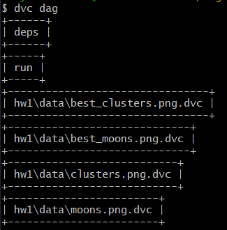

# engineering practices homeworks

#### HW5

Использовала dvc, stages добавлены в dvc.yaml  
Запуск: `dvc repro` (у меня в проекте нет никаких доп параметров, поэтому отдельно выставлять ничего не придется)

DAG, полученный из dvc:

